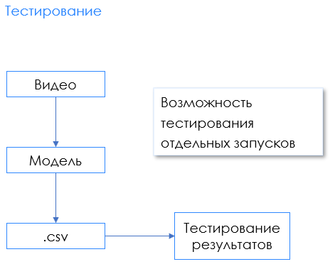
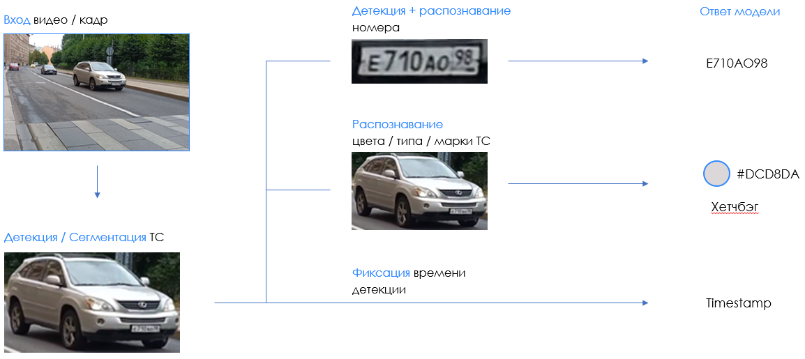

# plates_recognition

## Данные

1. Детекция автомобилей: [MIOvision Traffic Camera Dataset](https://tcd.miovision.com/)
2. Детекция номеров: [Car License Plate Detection](https://www.kaggle.com/datasets/evgrafovmaxim/nomeroff-russian-license-plates)
3. Распознавание номеров[Nomeroff Russian license plates](https://www.kaggle.com/datasets/evgrafovmaxim/nomeroff-russian-license-plates)

## Модуль тестирования модели на видео

**Настройка конфига**

Основные настройки задаются в конфиге **src/configs/config_test_video**:

* video_filepath - путь до видео
* gt_filepath - путь до разметки видео
* st_filepath [str | None] - путь до предсказаний по видео (если не None, то
* будут произведены вычисления)
* output_csv_directory_path - путь до директории, куда будут сохранены результаты предсказаний модели
* display_video [True | False] - воспроизводить видео или нет
* skip_frames_by_model [0, 1, 2, ...] - количество пропускаемых моделью кадров
* metrics_csv_directory_path - путь до директории, куда будут сохранены значения
* метрик

Для выбора определенной модели необходимо импортировать и создать соответсвующий
экземпляр в файле **test_video.py**. Модель должна иметь метод \_\_call\_\_(),
принимать на вход кадр и возвращать словарь с фиксированным набором ключей, где
значения по ключам - строки.

**Запуск**

Необходимо установить зависимости:

    pip install -qr requirements.txt

После всех настроек. Из src:

    python3 test_video.py

## Метрики

Для видео метрики считаются по объектам - по машинам. В данном пункте можно
считать слова **номер** и **машина** синонимами.

1. Верные предсказания по машинам. Данная метрика позволяет отслеживать, сколько
машин из представленных на видео модель распознает верно:

TPR = \dfrac{TP}{TP+FN}

2. Ложные предсказания по машинам. Данная метрика позволяет отслеживать, сколько
модель распознает машин, которых не было на видео:
   
FPR^{*} = \dfrac{FP}{TP+FP}

3. Среднее время распознавания машин. Данная метрика позволяет отслеживать, 
сколько времени модели требуется на распознавание автомобиля:
   
V = E_{t_j}

## Устройство системы

## Результаты обучения

* Детекция транспортных средств

| model        | Parameters                      | P    | R   | mAP50| mAP50-95 |
| -------------|:-------------------------------:| -----|-----|------|----------|
| Yolo5m       |size 736, 11 classes, 10 epochs  | 0.67 | 0.66| 0.69 | 0.47     |
| Yolo5m       |size 416, 7 classes, 20 epochs   | 0.83 | 0.81| 0.86 | 0.62     |
| Yolo5m       |size 416, 7 classes, 20 epochs,  lr=0.1, change augmentations   | 0.83 | 0.81| 0.85 | 0.6     |

* Детекция номера

| model        | Parameters                      | P    | R   | mAP50| mAP50-95 |
| -------------|:-------------------------------:| -----|-----|------|----------|
| Yolo5m       |size 256, 50 epochs  | 0.87 | 0.81| 0.86 | 0.45     |
| Yolo5m       |size 256, 50 epochs, iou_t=0.30,  anchor_t=3.0, change augmentations | 0.85 | 0.65| 0.77 | 0.37     |
| Yolo5m       |size 256, 50 epochs,  change augmentations   | 0.95 | 0.79| 0.88 | 0.45     |
| Yolo5m       |size 256, 100 epochs,  change augmentations   | 0.95 | 0.87| 0.94 | 0.52     |

* Распознавание номера

| model        | Parameters                      | P    | R   | mAP50| mAP50-95 |
| -------------|:-------------------------------:| -----|-----|------|----------|
|      |  |  | |  |      |
|      |  |  | |  |      |
|      |  |  | |  |      |
